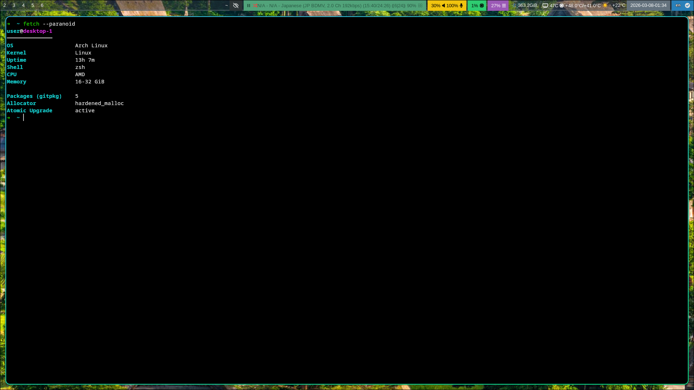

# Dotfiles



Arch Linux dotfiles, managed with [dotm](https://github.com/fkzys/dotm).

## Docs

- **[hardening](docs/hardening.md)**
    - [Memory allocator hardening](docs/hardening.md#memory-allocator-hardening)
    - [Application sandboxing](docs/hardening.md#application-sandboxing)

- **[lf](docs/lf.md)**
    - [Previews](docs/lf.md#previews)
    - [Watch tracking](docs/lf.md#watch-tracking)
    - [Keybindings](docs/lf.md#keybindings)

- **[notes](docs/notes.md)**
    - [Per-host configuration](docs/notes.md#per-host-configuration)
    - [Shell](docs/notes.md#shell)
    - [Systemd user services](docs/notes.md#systemd-user-services)
    - [Standalone scripts](docs/notes.md#standalone-scripts-localbin)
    - [Firefox](docs/notes.md#firefox)
    - [Secrets](docs/notes.md#secrets)

## What's included

- **WM**: Hyprland (via [uwsm](https://github.com/Vladimir-csp/uwsm)) + waybar + hyprpaper + hypridle/hyprlock + hyprsunset
- **Terminal**: kitty + zsh
- **Editor**: neovim + lazygit
- **Files**: lf + thunar
- **Audio**: mpd + ncmpcpp + mpv
- **Audio switching**: audio-device-switcher (PipeWire sink selection via wpctl + dmenu)
- **Bluetooth**: bt-audio (connect/disconnect paired BT audio devices via dmenu, auto-switch PipeWire sink)
- **Screenshots**: swappy (annotation tool)
- **Input**: fcitx5 + mozc (Japanese)
- **Theme**: Materia GTK + Kvantum + Papirus icons
- **Browser**: Firefox (flatpak, arkenfox user.js with overrides)
- **Cloud sync**: Nextcloud (sandboxed, systemd user service)
- **Proxy**: sing-box (config download + runner script, per-host URL from secrets)
- **Encrypted vault**: [keys-vault](https://github.com/fkzys/keys-vault) (gocryptfs FBE for `~/keys`, passphrase in GNOME Keyring, systemd user service with stale FUSE recovery)
- **Scripts**: ffmpeg\_jp (Japanese/English audio extraction + manual track selection), rename\_subs (subtitle renaming by episode), cabl (clipboard plumber / search dispatcher via dmenu), wofi-launcher (sandboxed application launcher with icons and usage sorting), dmenu (sandboxed wofi wrapper for dmenu compatibility)

## Shell (zsh)

No framework (oh-my-zsh, etc.) — prompt, completions, keybindings are configured manually.

### Prompt

robbyrussell-style prompt with inline git branch + dirty indicator (`✗`), implemented as a shell function (no plugin).

### PATH

`~/.local/bin` is prepended to `$PATH` via zsh's `path` array, deduplicated with `typeset -U path`.

### Plugins

- [zsh-autosuggestions](https://github.com/zsh-users/zsh-autosuggestions) — fish-like suggestions
- [zsh-syntax-highlighting](https://github.com/zsh-users/zsh-syntax-highlighting) — command highlighting

### Tools

- [zoxide](https://github.com/ajeetdsouza/zoxide) — smart `cd`
- [fzf](https://github.com/junegunn/fzf) — fuzzy finder (`Ctrl-T` files, `Alt-C` dirs, `Ctrl-R` history)
- [direnv](https://direnv.net/) — per-directory env

FZF uses `fd` for file/dir discovery and `bat`/`eza` for previews.

## Setup on a new machine

1. Create age key:
```bash
mkdir -p ~/keys/age
age-keygen -o ~/keys/age/dotm.txt
```

2. Initialize the vault:
```bash
keys-vault init
keys-vault open
```

3. Add public key to `.sops.yaml` and re-encrypt secrets:
```bash
# Edit .sops.yaml, add new recipient
sops updatekeys secrets.enc.yaml
```

4. Add host data to secrets:
```bash
sops secrets.enc.yaml
# Add entries under the relevant application keys
```

## Install

```bash
git clone https://github.com/fkzys/dotfiles.git
cd dotfiles
dotm init
dotm apply
```

During init, dotm will prompt for feature flags (nvidia, laptop, etc.).

### Package management

All packages (pacman, AUR, flatpak, gitpkg, pnpm) are managed by dotm via `dotm.toml`. A bootstrap script (`scripts/bootstrap.sh.tmpl`) installs the prerequisite tools (aurutils, gitpkg) on new machines before calling `dotm apply`.

## Credits

Some configs based on [tatsumoto-ren/dotfiles](https://github.com/tatsumoto-ren/dotfiles):
- `.local/bin/cabl`
- `.local/bin/dmenu`
- mpd, ncmpcpp, lf, fontconfig, mpv/input.conf

## License

AGPL-3.0-or-later
